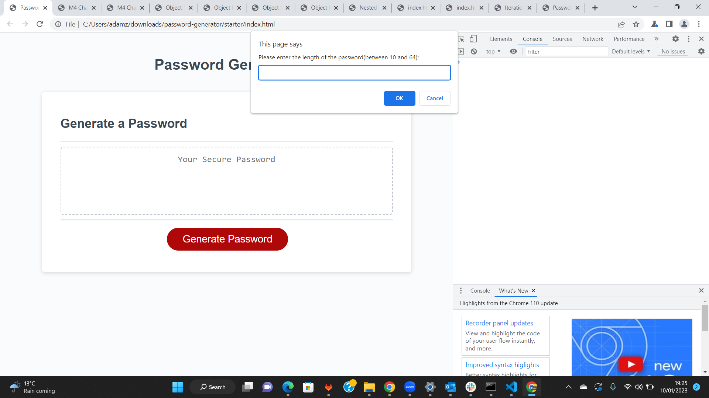

# Password-Generator

## Description
Creating a JavaScript application that randomly generates password on a prompt. With either lower case, Special symbols, Numeric Characters and or Upper case characters, the password can be between 10 and 64 characters in length.

## Installations
1. Create the repository on Github
2. Clone the repository onto the the local repo using git bash
Open the index.html file from the terminal using the ChromeDev tool

## Screenshot!

